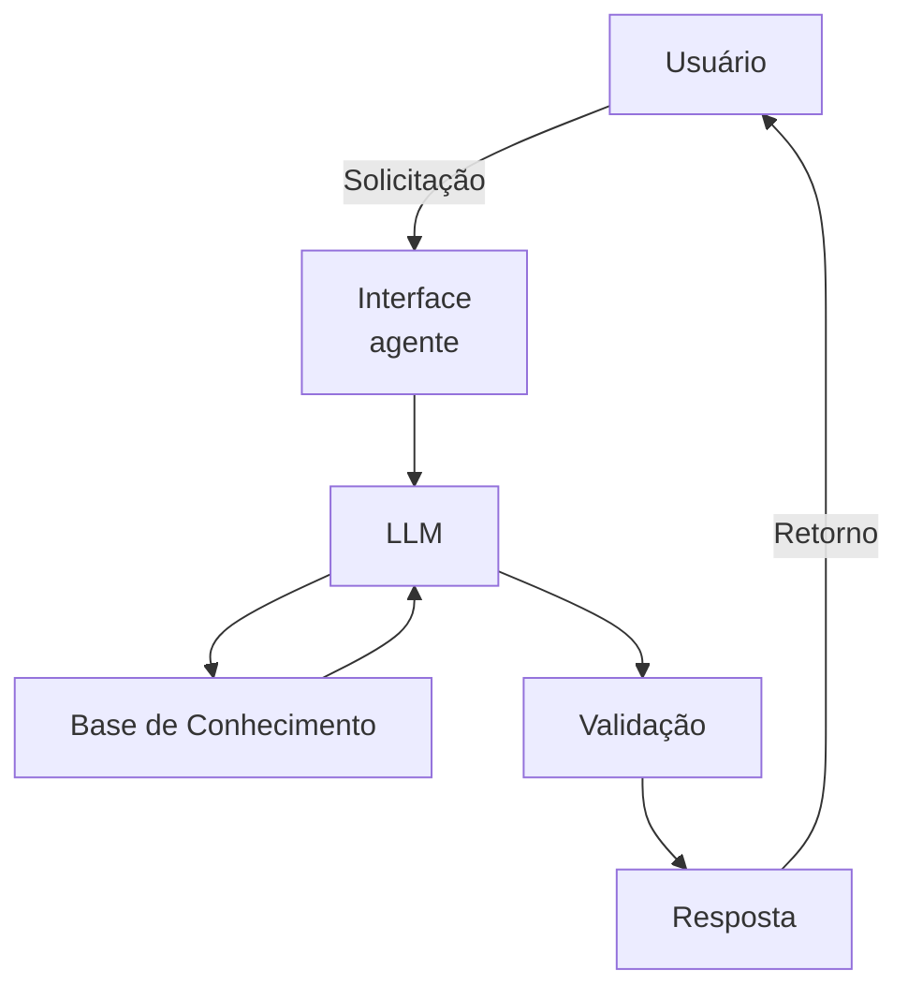

# Documentação do Agente

## Caso de Uso

### Problema
> Qual problema financeiro seu agente resolve?

1 - Consultar saldo.

2 - Ver extrato.

3 - Simular empréstimo.

4 - Saber limite do cartão.

5 - Segunda via de boleto.

6 - Bloquear cartão.

### Solução
> Como o agente resolve esse problema de forma proativa?

1. Consultar Saldo

O agente pode acessar o sistema interno do banco e retornar o valor disponível na conta do cliente após validação de identidade (senha, token ou biometria).
- O cliente digita: "Consultar saldo"
- O agente verifica os dados da conta e responde com o valor atualizado.
- Atendimento imediato, sem necessidade de falar com um atendente.

2. Ver Extrato

O agente pode buscar o histórico de movimentações da conta dentro de um período específico (ex: últimos 7 dias, 30 dias ou data personalizada).
- O cliente solicita: "Quero meu extrato dos últimos 30 dias"
- O agente consulta o banco de dados e exibe as transações organizadas por data.
- Transparência e controle financeiro rápido.

3. Simular Empréstimo

O agente pode calcular valores de parcelas com base em:
- Valor solicitado.
- Taxa de juros.
- Número de parcelas.
- O cliente informa o valor desejado e a quantidade de parcelas.
- O agente calcula automaticamente o valor final e o valor das parcelas.
- Ajuda o cliente a planejar antes de contratar o empréstimo.

4. Saber Limite do Cartão

O agente pode consultar o limite total, o valor já utilizado e o limite disponível.
- Limite total.
- Valor utilizado.
- Limite restante.

5. Segunda Via de Boleto

O agente pode gerar novamente um boleto vencido ou a vencer.
- O cliente informa o número do boleto ou CPF.
- O agente localiza o documento e gera um novo código de pagamento.
- Evita atrasos e multas maiores.

6. Bloquear Cartão

Em caso de perda ou roubo, o agente pode bloquear o cartão imediatamente.
- O cliente digita: "Perdi meu cartão"
- O agente confirma a identidade e realiza o bloqueio automático.
- Reduz risco de fraude e aumenta a segurança.

### Público-Alvo
> Quem vai usar esse agente?

Clientes da instituição, pequenos empreendedores e usuários que necessitam de atendimento rápido.

---

## Persona e Tom de Voz

### Nome do Agente
Íris, agente virtual de assistência.

### Personalidade
> Como o agente se comporta? (ex: consultivo, direto, educativo)

Tom profissional e cordial, que transmite confiança, respeito e segurança.

### Tom de Comunicação
> Formal, informal, técnico, acessível?

- Usar linguagem simples.
- Evitar termos técnicos complicados.
- Responder de forma direta.
- Confirmar informações importantes.

### Exemplos de Linguagem
- Saudação: [Ex: “Olá! Sou seu assistente virtual. Como posso ajudar você hoje?”]
- Confirmação: [Ex: Compreendido! Aguarde, vou verificar isso para você."]
- Erro/Limitação: [Ex: "Não posso executar essa solicitação"]

---

## Arquitetura

### Diagrama

### Componentes

| Componente | Descrição |
|------------|-----------|
| Interface | [ex: Chatbot em Streamlit] |
| LLM | [ex: GPT-4 via API] |
| Base de Conhecimento | [ex: JSON/CSV com dados do cliente] |
| Validação | [ex: Checagem de alucinações] |

---

## Segurança e Anti-Alucinação

### Estratégias Adotadas
- Não responder com informações não verificadas.
- Não dar aconselhamento jurídico.
- Não dar aconselhamento médico.
- Não opinar sobre política, religião ou outros assuntos.
- Não responder perguntas fora dos serviços definidos.

### Limitações Declaradas
> O que o agente NÃO faz?

O agente não pode:
- Contratar empréstimos automaticamente.
- Investir dinheiro pelo cliente.
- Alterar limites sem autorização.
- Realizar transferências sem confirmação.
